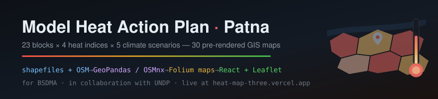
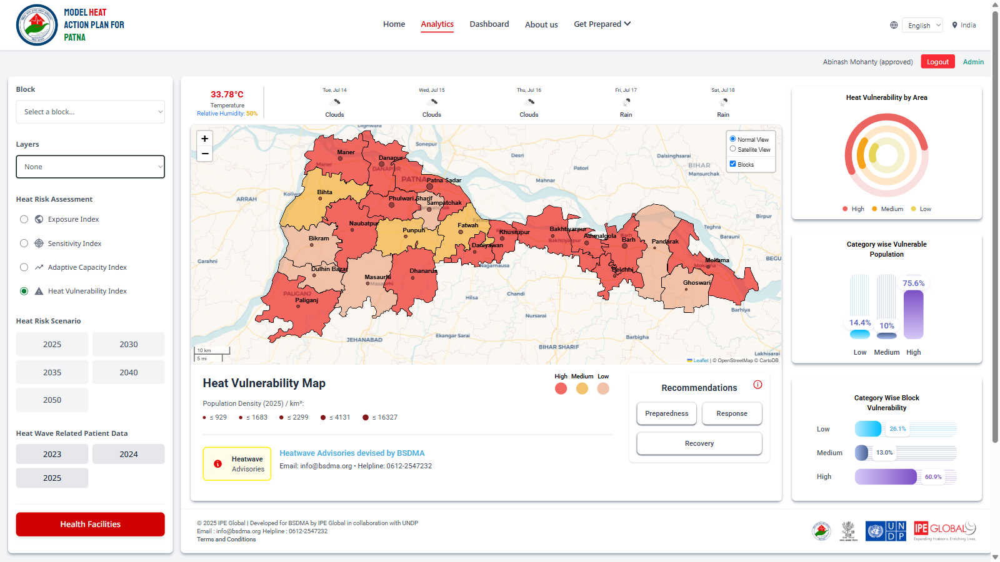
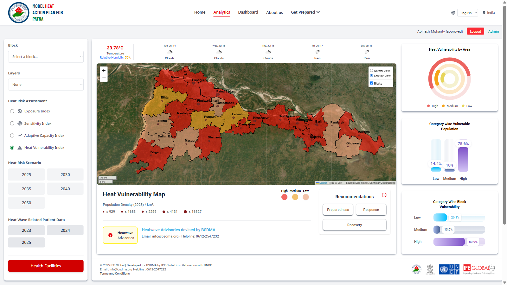
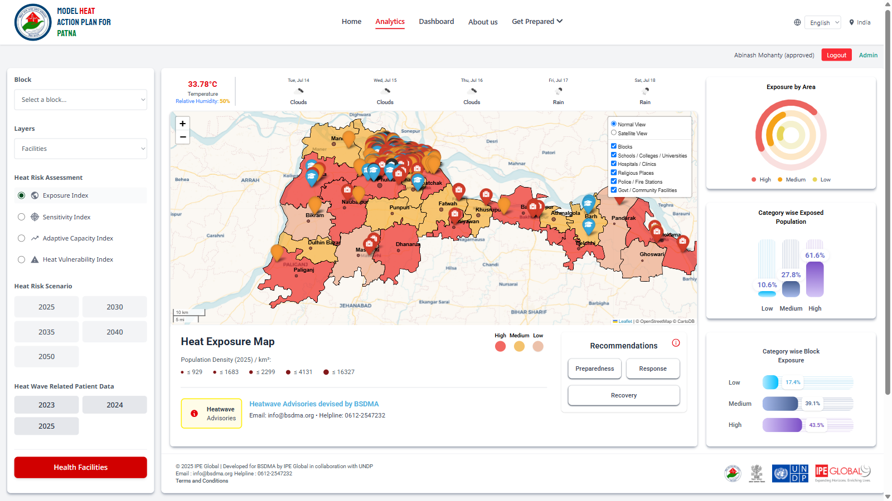
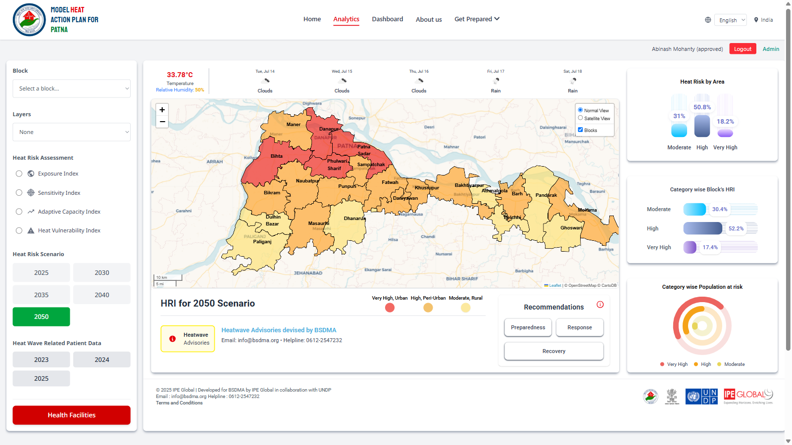
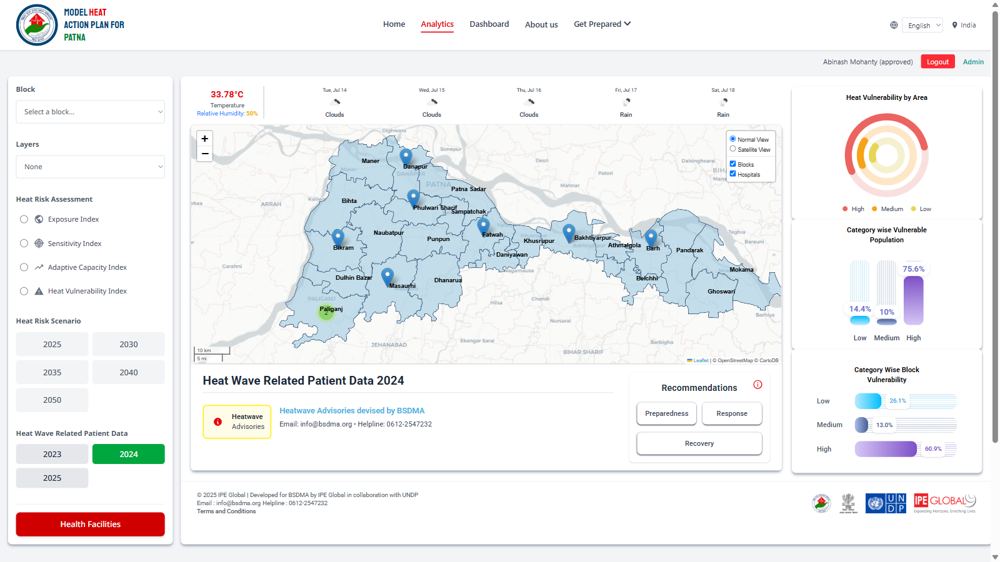
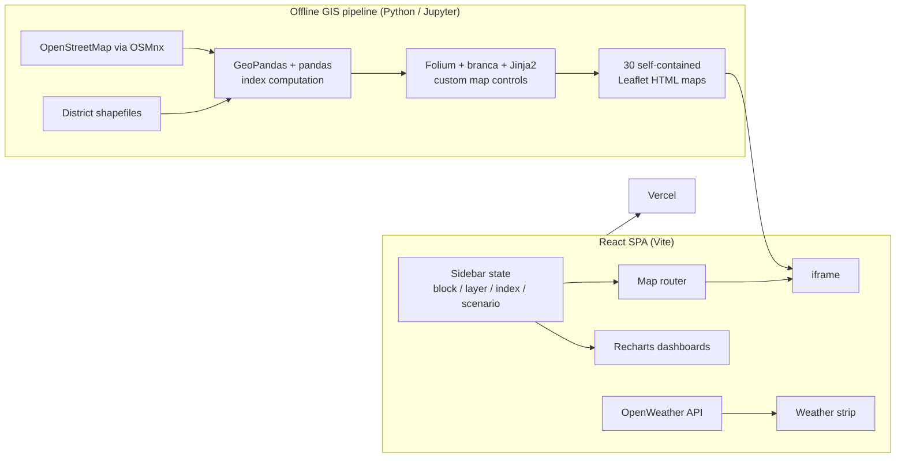

<div align="center">



**Interactive heat-risk analytics for Patna district — 23 administrative blocks scored across 4 heat indices and 5 climate scenarios, rendered from 30 pre-computed GIS maps.**

[](https://react.dev)
[](https://vitejs.dev)
[](https://tailwindcss.com)
[](https://leafletjs.com)
[](https://geopandas.org)
[](https://python-visualization.github.io/folium/)

**[Live demo → heat-map-three.vercel.app](https://heat-map-three.vercel.app/)**

</div>

---

Built for the **Bihar State Disaster Management Authority (BSDMA)** by **IPE Global** in collaboration with **UNDP**, as a freelance engagement. I owned the analytics frontend and the entire GIS map pipeline; authentication and the admin approval flow in the production deployment were built by a collaborator ([Ricobyter](https://github.com/Ricobyter)).

## What it does

Heatwaves are among Bihar's deadliest natural hazards. This platform turns raw census, health-facility, and land-use data into a decision tool: officials pick a block, an index, and a scenario, and get a choropleth map plus vulnerability breakdowns they can act on — preparedness, response, and recovery recommendations included.



The core idea: **all geospatial computation happens offline**. Shapefiles and OpenStreetMap extracts are processed in Python (GeoPandas + OSMnx + Shapely), and each map view is exported as a self-contained Folium/Leaflet HTML. The React app routes the right map into an iframe based on sidebar state — index × overlay × scenario — so the browser never computes geometry, and every map loads instantly with full pan/zoom, tooltips, and layer toggles intact.

| Satellite view | Facility overlays |
|---|---|
|  |  |

| 2050 climate scenario | Heat-wave patient data |
|---|---|
|  |  |

## By the numbers

| Metric | Value |
|---|---|
| Administrative blocks scored | 23 |
| Heat indices | 4 — Exposure, Sensitivity, Adaptive Capacity, Vulnerability |
| Climate scenarios | 5 — 2025, 2030, 2035, 2040, 2050 |
| Pre-rendered GIS maps | 30 self-contained Folium HTMLs (~26 MB) |
| Map overlay layers (live) | 10 — roads, water & sewer, facilities, land use, and more |
| Languages | English + हिन्दी |

## Highlights

- **Offline GIS pipeline** — Jupyter notebooks per index ingest district shapefiles, join census indicators with pandas, pull roads/water/health-facility geometry from OpenStreetMap via OSMnx, dissolve boundaries with Shapely's `unary_union`, and export interactive Folium maps with custom Jinja2 `MacroElement` controls (normal/satellite radio switch, block toggles) baked into each HTML.
- **Zero-latency map switching** — 30 map permutations are static files served from `public/`; switching index, overlay, or scenario is an iframe `src` swap, not a re-render. Esri satellite and CartoDB tile layers are embedded per map.
- **Composite risk scoring** — Heat Vulnerability Index combines exposure, sensitivity, and adaptive capacity per block; future scenarios (2030–2050) reclassify blocks into urban/peri-urban/rural risk bands.
- **Analytics dashboard** — Recharts donut and bar charts break down vulnerable population and block risk by category, synchronized with the selected index.
- **Live context** — OpenWeather API strip shows current temperature, humidity, and a 5-day forecast for Patna alongside the historical risk maps.
- **Bilingual** — full English/Hindi switching via Google Translate integration, covering every label including map controls.

## Architecture



The sidebar's selections form a key into lookup tables in `HeatMap.jsx`; each key resolves to one pre-rendered map file. Charts and recommendation panels react to the same state, so the map, statistics, and advisories always describe the same slice of data.

## Quick start

```bash
git clone https://github.com/Baranwal-47/heat_map.git
cd heat_map
npm install
echo "VITE_WEATHER_API_KEY=<your OpenWeather API key>" > .env
npm run dev        # http://localhost:5173
npm run build      # production build (verified)
```

> The production deployment adds email/password authentication with admin approval — sign up at the [live site](https://heat-map-three.vercel.app/) and an admin approves your account before analytics unlock.

## Project structure

```
heat_map/
├── public/                      # 30 pre-rendered Folium map HTMLs (~26 MB)
│   ├── *_index_satellite.html         # base index maps
│   ├── *_road_satellite*.html         # road overlays
│   ├── *_water_sewer*.html            # water & sewer infrastructure
│   ├── *_health_facilities.html       # health-facility overlays
│   └── vulnerability_index_20*.html   # 2030–2050 scenario maps
├── src/
│   ├── components/
│   │   ├── HeatMap.jsx          # sidebar-state → map-file routing + legend
│   │   ├── Sidebar.jsx          # block / layer / index / scenario controls
│   │   ├── Dashboard.jsx        # analytics layout
│   │   └── charts/              # 11 Recharts components (donut/bar per index)
│   ├── pages/                   # Home, Homepage, Terms
│   └── main.jsx
└── vite.config.js
```

## Technical notes

<details>
<summary><strong>Why pre-rendered maps instead of client-side GeoJSON?</strong></summary>

Rendering 23 block polygons with census-joined tooltips, multiple tile providers, and OSM-derived overlay geometry client-side would mean shipping and parsing several MB of GeoJSON per view and recomputing styling on every switch. Baking each view into a Folium HTML moves all of that to a one-time offline step: the browser just loads a static file with Leaflet already wired up. The trade-off — data updates require re-running the notebook — fits the domain, since census and infrastructure data change yearly, not hourly.

</details>

<details>
<summary><strong>Custom controls inside generated maps</strong></summary>

Folium doesn't ship a normal/satellite radio switcher or styled block toggles, so the pipeline injects them with `folium.MacroElement` + Jinja2 `Template`: raw JS/CSS is rendered into the exported HTML and talks to the Leaflet instance directly. That's how each map carries its own view switcher and layer checkboxes with zero React involvement.

</details>

<details>
<summary><strong>Scenario routing logic</strong></summary>

`HeatMap.jsx` resolves the map file with a priority cascade: scenario year (2030/2035/2040/2050 force the corresponding HRI projection map) → overlay layer (roads / water-sewer / health facilities pick the overlay variant) → base index map. Projection years also swap the legend from High/Medium/Low to Very-High-Urban / High-Peri-Urban / Moderate-Rural, matching how the projected indices were classified.

</details>

Natural extensions: dynamic GeoJSON serving with vector tiles for live data updates, and code-splitting the chart bundle.

Built end-to-end — from raw shapefiles to a deployed decision-support tool used by a state disaster-management authority.
